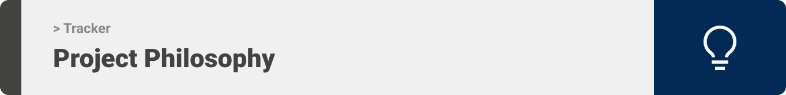
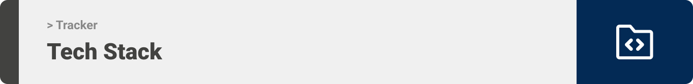
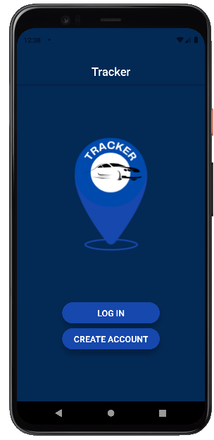
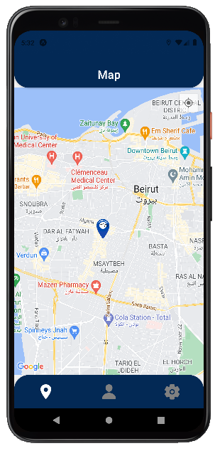

<div align="center">

> Hello world! This is the project’s summary that describes the project plain and simple, limited to the space available.

**[PROJECT PHILOSOPHY](https://github.com/julescript/well_app#-project-philosophy) • [WIREFRAMES](https://github.com/julescript/well_app#-wireframes) • [TECH STACK](https://github.com/julescript/well_app#-tech-stack) • [IMPLEMENTATION](https://github.com/julescript/well_app#-impplementation) • [HOW TO RUN?](https://github.com/julescript/well_app#-how-to-run)**

</div>

<br><br>



> Tracker Application is a car tracker application with a real time GPS tracking system for car, that alert the user if his/her car is being robbed
>
> Whenever the car is active a push notification is sent to the user alerting him that his car is moving now, so if he did the action he check ok on the notification if not he can track the car to see its destination.

### User Stories

- As a User, I wants to locate my car, So that I find it faster.
- As a User, I wants to track my car any time, So I can know if it is being robbed.
- As a User, I wants to get notification if my car is active, So I can know if it is being robbed.
- As a User, I want to see the destination of my car if it has been robbed, So i can find it easily.

<br><br>


> This design was planned before on paper, then moved to Figma app for the fine details.
> Note that i didn't use any styling library or theme, all from scratch and using pure css modules

| Landing                                     | Login                                      |
| ------------------------------------------- | ------------------------------------------ |
|  |  |

| Register                                     | Map Screen                                    |
| -------------------------------------------- | --------------------------------------------- |
|  |  |

| Settings Screen                              | Settings Popup                            |
| -------------------------------------------- | ----------------------------------------- |
|  |  |

<br><br>



Here's a brief high-level overview of the tech stack the Well app uses:

- Frontend: This project uses the [React Native Framework](https://reactnative.dev/). React native is an open-source JavaScript framework, designed for building apps on multiple platforms like iOS, Android, and also web applications, utilizing the very same code base. It is based on React, and it brings all its glory to mobile app development.
- Backend: The backend is implemented using [Laravel](https://laravel.com/) which is a free and open-source PHP web framework, intended for the development of web applications following the model–view–controller (MVC) architectural pattern and based on Symfony.
- For persistent storage (database), the app uses [MySQL](https://www.mysql.com/) for users and [Firebase](https://firebase.google.com/) for Notifications and car location. MySQL is a relational database management system based on SQL – Structured Query Language. Google Firebase is a Google-backed application development software that enables developers to develop iOS, Android and Web apps. Firebase provides tools for tracking analytics, reporting and fixing app crashes, creating marketing and product experiment.
- To send local push notifications, the app uses the [expo-notifications](https://docs.expo.dev/versions/latest/sdk/notifications/) package which provides an API to fetch push notification tokens and to present, schedule, receive and respond to notifications.
- For displaying maps and allowing users to see their car's location, the app uses [react-native-maps](https://github.com/react-native-maps/react-native-maps) which is a component system for maps that ships with platform-native code that needs to be compiled together with React Native.
- For Hardware the app uses [412 ARDUINO SENSOR IR DETECTOR](https://katgates.com/En/product_det/434693) to help implement the live location built with this application.

<br><br>


> Using the above mentioned tech stacks and the wireframes build with figma from the user sorties we have, the implementation of the app is shown as below, these are screenshots from the real app

| Landing                                | Login                                |
| -------------------------------------- | ------------------------------------ |
|  |  |

| Register                                | Map Screen                         |
| --------------------------------------- | ---------------------------------- |
|  |  |

| Settings                                | Settings/Popup                                |
| --------------------------------------- | --------------------------------------------- |
|  |  |

<br><br>


> To get a local copy and run the application follow these simple steps:

### Prerequisites

- Download and Install [Node.js](https://nodejs.org/en/)
- Download and Install [Composer](https://getcomposer.org/)
- Download and Install [XAMPP](https://www.apachefriends.org/)

- npm
  ```sh
  npm install npm@latest -g
  ```
- Expo CLI
  ```sh
  npm install --global expo-cli
  ```
- Expo Go app for iOS and Android
  <br> _[Android Play Store](https://play.google.com/store/apps/details?id=host.exp.exponent) - Android Lollipop (5) and greater._
  <br> _[iOS App Store](https://apps.apple.com/app/expo-go/id982107779) - iOS 11 and greater._

- [Android Studio](https://developer.android.com/) or [BlueStacks](bluestacks.com) or any tool that run an emulator on your PC.

### Installation

- Clone the repo
  ```sh
  git clone https://github.com/malakshaer/tracker.git
  ```

### To Run frontend mobile application

1. Navigate to the Frontend folder then ReactNative folder and install dependencies
   ```sh
   cd tracker/frontend
   npm install
   ```
2. Run the start up command
   ```sh
   npm start
   ```

### To Run Laravel Server on your machine

1. Create a database locally named tracker_db
2. Navigate to the backend folder
   ```sh
   cd tracker/backend
   ```
3. Inside the .env file in your backend folder insert the db name as follows
   <br> _DB_DATABASE=tracker_db_

4. Run migration
   ```sh
   php artisan migrate
   ```
5. Start the Server
   ```sh
   php artisan serve
   ```
