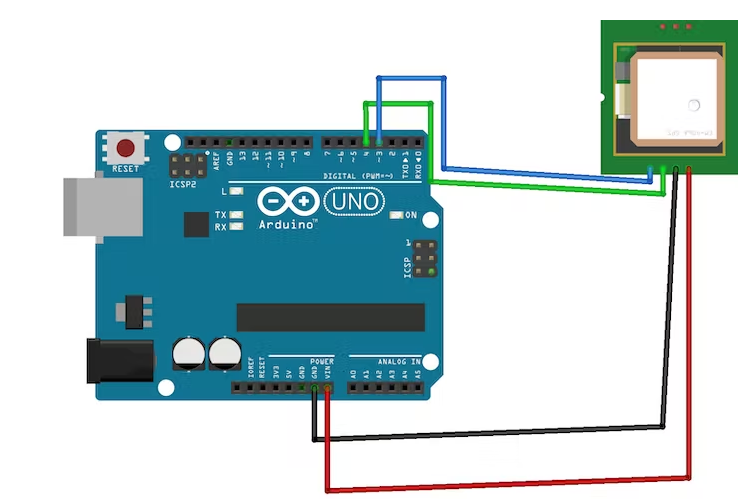

### About This Project

Arduino-based vehicle tracking system using GPS Module.The system can be installed or hidden in your vehicle. After installing this circuit, you can easily track your stolen vehicle using a mobile phone. you can also use this application to track the school/college bus.

### Parts and Tools

- Arduino
   

- GPS Module
   

- Jumper wires
   

- Circuit diagram  
   
